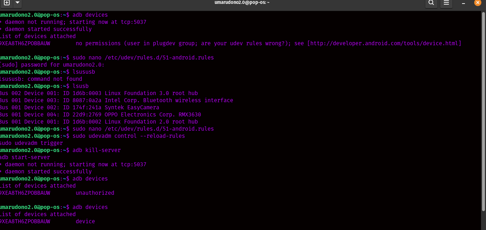

 Important Note:  I played around with these commands on Linux Pop!_OS, but they should work on other Linux versions too! 🐧✨ If something refuses to cooperate (a.k.a. doesn’t work 😭), you can always find alternative ways~ 💡 Hope this helps, and please don’t curse me if it doesn’t! (I tried my best XD! 😆💕)  I’m still improving this, so it’s a work in progress😸

 
## Bash terminal commands
### cd ~/Downloads

### Git Terminal commands 
### git pull origin main --rebase
- used to fetch changes from the remote repository and reapply your local commits on top of those changes, rather than merging them
### git push -u origin main --force
- overwrite the remote branch
### Ctrl +C 
- Cancel commit process

## Installing Android Studio
- cd ~/Downloads
- tar -xzvf android-studio-2024.2.2.13-linux.tar.gz
- sudo mv android-studio /opt/
- cd /opt/android-studio/bin
./studio.sh

### Native Luncher android studio 
- 1. sudo nano /usr/share/applications/android-studio.desktop
- 2. Desktop Entry
Version=1.0
Name=Android Studio
Comment=Android Studio IDE
Exec=/opt/android-studio/bin/studio %f
Icon=/opt/android-studio/bin/studio.png
Terminal=false
Type=Application
Categories=Development;IDE;
- 3. Save and close the file (CTRL + X, then Y, then Enter).

### Connecting to adb (Android Debug bridge)
- sudo apt install adb
- sudo usermod -aG plugdev $USER  (then restart computer)
- still no permisiion?
- sudo nano /etc/udev/rules.d/51-android.rules  
- This (up) is nano
- SUBSYSTEM=="usb", ATTR{idVendor}=="18d1", MODE="0666", GROUP="plugdev"            
- 
- Save and exit (in nano, press Ctrl + O to save and Ctrl + X to exit).
- sudo usermod -aG plugdev $USER
- adb devices
- lsusb   (check device id)
- Look for something like this: Bus 001 Device 002: ID 18d1:4ee7 Google Inc.
- insert to nano
### Reloading Udev rules
- sudo udevadm control --reload-rules
- sudo udevadm trigger
### Restart Adb Server
- adb kill-server
- adb start-server
-  Unplug & Replug Your Device Physically disconnect the USB cable from your phone. Reconnect it after a few seconds.

### Check adb devices
- 
### Reload Udev Rules
- sudo udevadm control --reload-rules
- sudo udevadm trigger

### Installing Packet Tracer in Linux 
1. Download Cisco Packet Tracer

    Go to NetAcad and log in.
    Download Packet Tracer 8.2.2 Ubuntu 64bit.
   - Packet_Tracer822_amd64_signed.deb

   
2. Install Packet Tracer

    Open a terminal (Ctrl + Alt + T) and go to the Downloads folder:
   - cd ~/Downloads
  
   
3. Install the .deb package using:
   - sudo dpkg -i Packet_Tracer822_amd64_signed.deb (yourfile name)
   If there are missing dependencies, fix them with:
      - sudo apt --fix-broken install

4. Connect your PacketTracer to your cisco account (or use it in guest mode)
5. Fix the Login Issue (Blank Page)

If the login page is blank when you open Packet Tracer, run this command:
- QTWEBENGINE_DISABLE_SANDBOX=1 packettracer
  This disables the sandboxing feature in Qt WebEngine, allowing the login page to load properly. Now You're Ready! 🎉

For linux mint XFCE (my friend encountered many issues in installing packettracer here)
- error libgl1-mesa-glx
  
  Step 1: Add the Required Ubuntu Repository

 - add the Ubuntu 22.04 (Jammy) repository manually:
 - echo "deb http://archive.ubuntu.com/ubuntu jammy main universe" | sudo tee /etc/apt/sources.list.d/jammy.list

update package list 
- sudo apt update

Step 2: Install the Missing Dependencies

Now install libgl1-mesa-glx from the added repository:
- sudo apt install libgl1-mesa-glx libxcb-xinerama0 libxcb-xinerama0-dev
if it doesn't work try:
- sudo apt install libgl1

Step 3: Install Packet Tracer Again

Once dependencies are installed, reinstall Packet Tracer:
- sudo dpkg -i CiscoPacketTracer822_amd64_signed.deb

then fix any broken dependency 
- sudo apt --fix-broken install

Step 4 : All set Now run packet tracer 🥳

